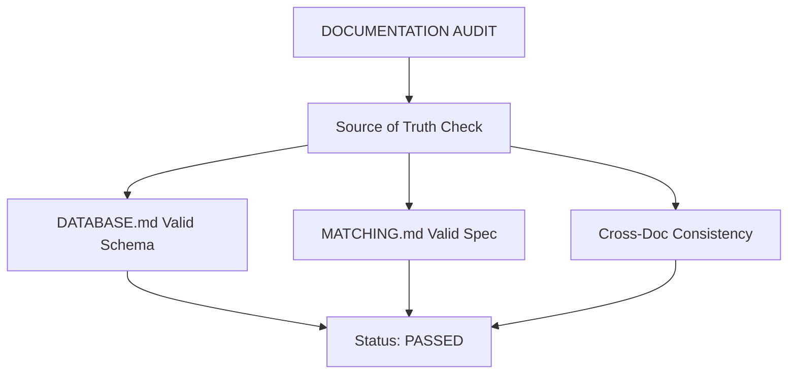
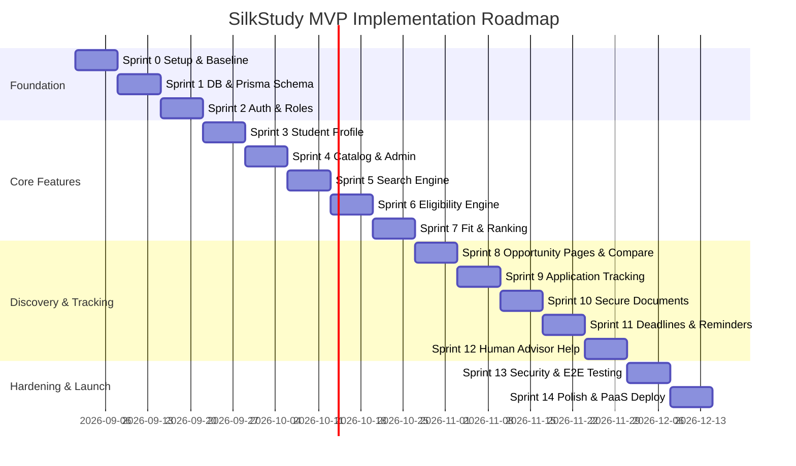

# SilkStudy System Review & Architectural Audit Report

**Date:** August 20, 2026  
**Status:** Comprehensive Review Complete  
**Scope:** Full documentation suite (`ARCHITECTURE.md`, `DATABASE.md`, `MATCHING.md`, `SEARCH.md`, `DATA_INGESTION.md`, `API.md`, `SECURITY.md`, `TESTING.md`, `ROADMAP.md`, `IMPLEMENTATION_PLAN.md`)

---

## 1. Executive Summary

**SilkStudy** is an exceptionally well-specified, highly disciplined study-abroad platform designed to guide students through the lifecycle of **Discover → Understand → Verify → Compare → Decide → Prepare → Apply → Track → Get Human Help**.

Unlike typical modern software proposals that rush toward complex AI chatbot architectures and microservice sprawl, SilkStudy establishes a **"boring, robust, trusted, and explainable"** foundation. It prioritizes data provenance, deterministic eligibility, explicit budget/funding semantics, and zero-hallucination recommendation algorithms.

### System Verification Status



- **Pre-Implementation Check (Sprint 0 Requirement):** PASSED. `DATABASE.md` contains the full schema, `MATCHING.md` contains the explicit deterministic algorithm, and no file content is missing or misplaced.
- **Architectural Coherence:** 10/10. All 10 documents strictly enforce the modular monolith pattern, PostgreSQL single-instance storage, deterministic gates, and strict separation between MVP scope and future AI/ML layers.

---

## 2. Core Architectural Principles & Stack Review

| Layer | Architecture Choice | Audit Assessment & Rationale |
|---|---|---|
| **Architecture Style** | Modular Monolith | **Optimal for MVP.** Internal domains (`students`, `catalog`, `matching`, `documents`, `applications`, `advisors`) communicate via internal service interfaces, preserving easy future service extraction without premature microservice overhead. |
| **Tech Stack** | Next.js (TypeScript) + Node.js | Single language across frontend and backend lowers cognitive load and context switching. |
| **Database** | PostgreSQL + Prisma ORM | Single managed DB instance handling relational data, full-text search (`tsvector` + `pg_trgm`), and vector embeddings (`pgvector`). Avoids polyglot persistence complexity. |
| **Search Engine** | Layered SQL Filters → FTS → `pgvector` | Progressive degradation & fallback. Relies on structured PostgreSQL column queries first, text search second, and vector search only when justified. |
| **Matching Logic** | Hard Gate Eligibility + Weighted Fit | **100% Deterministic.** Zero LLM involvement in eligibility decisions. Strict separation of eligibility (boolean pass/fail) and fit (0-100 explainable score). |
| **Document Storage** | Private S3-Compatible Object Storage | File bytes stored in object storage (R2/B2); only metadata stored in DB. Private by default using short-lived signed URLs and ClamAV scanning. |
| **Background Jobs** | Postgres-backed Queue (`pg-boss`) | Handles deadline reminders, notification sends, document scanning, and embedding generation without requiring Redis/Kafka/RabbitMQ. |

---

## 3. Deep-Dive Review by Module

### 3.1 Data Provenance & Catalog Ingestion (`DATA_INGESTION.md` & `DATABASE.md`)
- **Fact-Level Provenance:** SilkStudy tracks provenance at the individual fact level (`sources`, `fact_sources`). Each critical fact (tuition, deadline, scholarship coverage) carries `source_url`, `verified_by`, `verified_at`, and `verification_status`.
- **Funding Deconstruction:** Avoids misleading "fully funded" labels. Deconstructs funding into explicit categories (`tuition`, `living_expenses`, `accommodation`, `transport`, `insurance`, `visa`, `monthly_stipend`) and coverage levels (`FULL`, `PARTIAL`, `NONE`, `UNKNOWN`).
- **Data Lifecycle:** Clear state machine: `DISCOVERED → DRAFT → NEEDS_REVIEW → VERIFIED → PUBLISHED → STALE → OUTDATED → ARCHIVED`.

### 3.2 Deterministic Matching & Fit Engine (`MATCHING.md`)
- **Rule Contract:** `eligibility_rule_versions` uses versioned JSON trees with nested `all` and `any` operators. Supports controlled fields (`academic.gpa`, `languages.english.level`, `student.nationality`, etc.).
- **Strict Missing Data Semantics:** Unknown data evaluates explicitly to `UNKNOWN` (never defaulted to `false` or `0`). 
  - `all` group with one `FAIL` → `FAIL`.
  - `all` group with no `FAIL` but at least one `UNKNOWN` → `UNKNOWN`.
- **Fit Scoring Breakdown:**
  ```text
  Field Fit (20%) + Budget Fit (20%) + Academic Fit (15%) + Funding Fit (15%) 
  + Language Fit (10%) + Country Fit (7%) + Degree Fit (5%) + Deadline Fit (5%) + Study-Mode Fit (3%) = 100%
  ```
- **Explainability:** Every match response returns structured arrays of `positive_reasons`, `negative_reasons`, and `unknown_factors`.

### 3.3 Search & Discovery Pipeline (`SEARCH.md` & `API.md`)
- **Query Understanding:** Deterministic parsing into structured filters (`degree_level`, `field`, `countries`, `budget`).
- **Strict Relaxation Policy:** The engine **never** silently relaxes hard filters (e.g. country or budget) when zero results are found. Instead, it returns `0` results with explicit, user-actionable relaxation recommendations.

### 3.4 Security & Document Vault (`SECURITY.md`)
- **IDOR Protection:** All `/api/v1/me/*` endpoints derive ownership from the authenticated session server-side. Client-provided `user_id` or `role` are strictly ignored.
- **Document Handling:** Direct-to-S3 uploads via short-lived signed URLs. Uploaded files remain in quarantine (`PENDING_UPLOAD` / `SCANNING`) until malware scanning passes.
- **Audit Logging:** Append-only audit log records document access, profile exports, advisor delegations, and admin catalog modifications.

### 3.5 Testing Strategy & AI Operating Rules (`TESTING.md` & `IMPLEMENTATION_PLAN.md`)
- **Regression Seed Dataset:** Includes complex test cases (full tuition + living, tuition-only, living stipend only, unknown coverage, language/GPA restrictions, multi-cycle deadlines).
- **Agent Execution Safeguards:** `IMPLEMENTATION_PLAN.md` divides development into 15 bounded sprints (Sprint 0 to Sprint 14), restricting file access per task and prohibiting unauthorized schema changes or premature AI additions.

---

## 4. Key Strengths & Highlights

1. **High Commercial & User Trust:** By displaying data provenance and verification dates on every fact, SilkStudy directly addresses the #1 pain point of study-abroad applicants: inaccurate or outdated web data.
2. **Explainable AI Readiness:** The separation between deterministic rule execution and future RAG/LLM Q&A ensures that LLMs explain decisions rather than hallucinate eligibility.
3. **Low Infrastructure Cost (Pre-Revenue):** Single Postgres instance, containerized monolith, PaaS hosting (Railway/Render/Fly.io), and S3 storage keep operational costs under \$50–\$100/month initially.

---

## 5. Actionable Recommendations & Open Decisions

While the documentation is robust, the following minor gaps and open decisions should be finalized during Sprint 0 / Sprint 2:

### 1. Managed Auth Provider Selection (`SECURITY.md` §6)
> [!NOTE]
> **Recommendation:** Standardize on **Auth.js (NextAuth)** or **Clerk** for MVP. Clerk provides out-of-the-box user management, role metadata, and webhooks with minimal maintenance.

### 2. Multi-Currency Normalization Strategy (`MATCHING.md` §14)
> [!IMPORTANT]
> Students may specify budgets in TND (Tunisian Dinar), EUR, or USD, while university tuition may be in EUR/GBP.
> **Recommendation:** Store a daily cached currency exchange table in Postgres (`exchange_rates`) to normalize all comparisons into EUR before running matching scoring.

### 3. Asynchronous Match Recomputation (`API.md` §22)
> [!TIP]
> Recomputing match results across a catalog of thousands of opportunities synchronously during profile updates could trigger API timeouts.
> **Recommendation:** Route profile update triggers to `pg-boss` background jobs and stream status to the UI, as described in `API.md` Option B.

### 4. Application Status State Machine (`ROADMAP.md` §15)
> [!NOTE]
> Define explicit allowed status transitions in Sprint 9:
> `PLANNED → PREPARING → SUBMITTED → UNDER_REVIEW → ACCEPTED / REJECTED / WITHDRAWN`.

---

## 6. Implementation Roadmap Summary



---

## 7. Conclusion

The **SilkStudy** documentation suite is comprehensive, production-grade, and ready for immediate implementation. The architecture strikes the perfect balance between high user trust, strict data security, and lean operational overhead.
